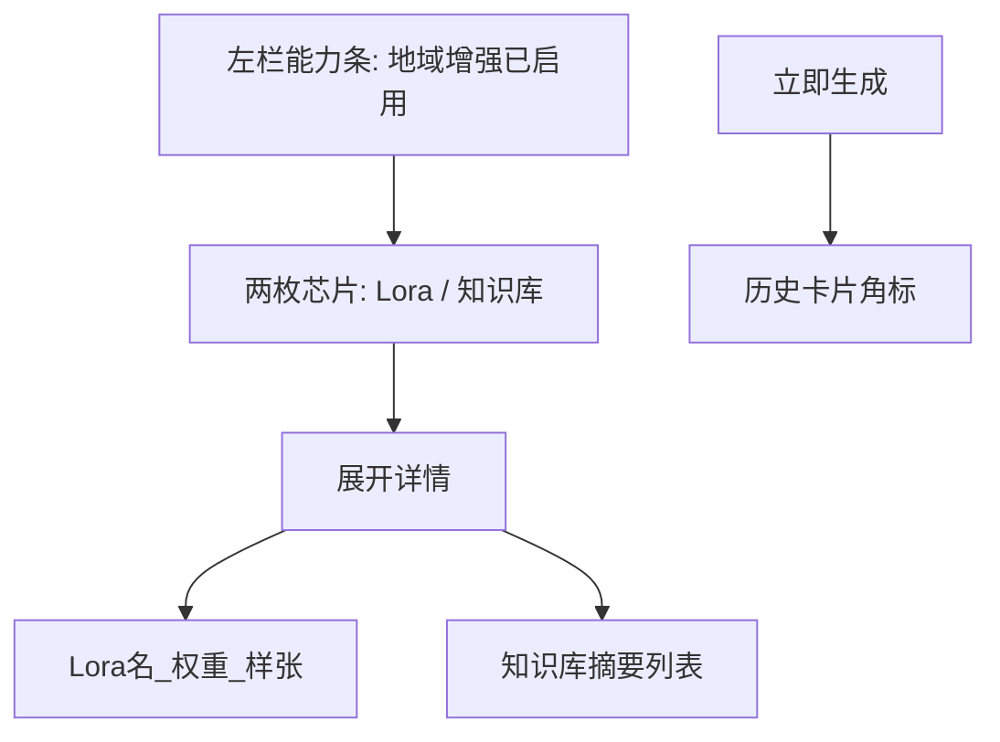

# Logo 地域 Lora / 知识库展示方案（仅方案，不改代码）

> 范围：**只输出展示与信息架构方案**。当前不实现 UI、不改 logo 生成链路、不接真实 Lora / 知识库推理。

## 目标

在 **品牌设计 · logo** 让用户一眼理解：本功能已接入（或本次出图会用到）**地域 Lora** 与 **地域知识库**，且不打断现有「风格 → 品牌名 → 创意描述 → 生成」主路径。

## 现状锚点

现有左栏 `ImageLogoPanel`（`mofun/src/components/image/ImagePanels.tsx`）：logo 风格 / 品牌名称 / 创意描述 / 立即生成；右侧为生成历史。页面上尚无地域、Lora、知识库相关展示。

## 推荐展示形态

**能力背书 + 可展开详情**（不是资产商店、也不是必选配置项）。默认演示地域：「安吉」（日后可接顶栏地区 / 账号归属）。



### 1. 左栏能力条（主感知）

位置：建议在「logo 风格」**上方**（进入功能即可见）。

- 标题：`地域增强已启用` + 地域名（如 `安吉`）
- 两枚常亮芯片（表示「已接入」，非开关）：
  - `Lora · 安吉白茶风格`
  - `知识库 · 已引用 3 条`
- 「详情」展开内容：
  - **地域 Lora**：名称、一句话说明、可选风格样张、强度示意（如 `0.7`）
  - **地域知识库**：3～5 条短摘要（产地 / 工艺 / 文化符号），只读

原则：用户不必先选 Lora 才能生成；能力条是「系统状态」，不是第三套表单。

### 2. 生成过程与结果（二次强化）

- 生成中文案可带：`正在应用地域 Lora 与知识库…`
- 历史结果卡角标：`地域增强 · 安吉`（或拆成 Lora / 知识库两枚小标）
- 点角标打开与左栏相同的详情结构

### 3. 信息结构（概念模型，暂不落库）

```ts
type RegionAssetPack = {
  regionId: string;
  regionName: string; // 安吉
  lora: { id: string; name: string; blurb: string; strength: number; thumb?: string };
  knowledge: { id: string; title: string; summary: string }[];
};
```

展示层只消费「当前地域包」；真实权重加载 / RAG 检索属后续能力，不在本方案落地范围。

## 视觉原则

- 沿用现有品牌绿与 `ws-panel` / chip 语言，避免新套 AI 炫光风
- 能力条：浅绿底 + 细边框，读起来像状态条
- 详情：抽屉或居中卡片，避免把左栏撑成长文

## 文案示例（可直接用于评审）

| 位置 | 文案 |
|------|------|
| 能力条标题 | 地域增强已启用 · 安吉 |
| Lora 芯片 | Lora · 安吉白茶风格 |
| 知识库芯片 | 知识库 · 已引用 3 条 |
| Lora 详情说明 | 强化云雾茶园、嫩芽、清新国风笔触，避免通用茶叶贴纸感 |
| 知识库条目例 | 「明前茶：清明前后采摘，氨基酸含量高，鲜爽回甘」 |
| 生成中 | 正在应用地域 Lora 与知识库… |
| 结果角标 | 地域增强 · 安吉 |

## 明确不做（本阶段）

- 不修改任何现有功能与代码
- 不接真实 Lora 推理 / 知识库 RAG
- 不做多地域切换商店
- 不改变品牌名等必填顺序

## 若日后要落地（仅备忘，非本次任务）

可落在：`ImageLogoPanel` 顶部挂条、共用详情组件、logo 历史角标、演示数据包与样式。需明确「开始实现」后再动代码。

## 方案验收（评审用）

- 评审者能说清：用户在哪看到「用了 Lora」、在哪看到「用了知识库」
- 主生成路径不被打断
- 详情信息足够支撑「地域差异化」叙事，又不像后台配置页
