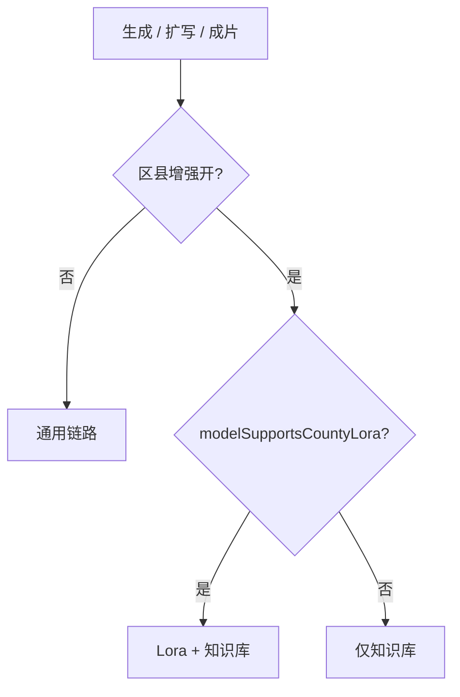

# 八大创作模块 · 区县增强改造说明

> 依据：[文生图区县增强模型与知识库调用逻辑](./文生图区县增强模型与知识库调用逻辑.md)  
> 范围：**活动、商拍、Logo、IP 设计、AI 字体、一句话成片、制作大片、数字人模特**  
> 目标：汇总上述功能里所有「区县增强」相关改造（UI、模型、知识库、Lora、历史角标、Toast、账号地名），并与当前代码实现对齐。

文案统一用「区县」，不用「地域」。

---

## 0. 共用基础设施（本批模块均依赖）

| 能力 | 文件 | 说明 |
|------|------|------|
| 账号区县 | `src/lib/auth.ts` + `regionEnhance.accountRegionId` | 优先 `user.regionId`，否则从地址/企业名推断；演示账号默认 `anji` / 安吉 |
| 增强总开关语义 | `src/lib/regionEnhance.ts` | 关：无 KB、无 Lora；开：必可注入知识库；仅区县模型族可挂 Lora |
| 知识库字段 | `kbFields(enabled, regionId)` | `{ useKB, county, kbContext }` |
| 出图封装 | `imageRequestBody` / `applyRegionToImagePrompt` | prompt 追加 `【区县知识库·县名】`；满足 Lora 条件再追加 Lora 说明并传 `lora[]` |
| 区县模型族 | `src/lib/imageModelCatalog.ts` | 文生：`Qwen-Image-本地-文生图`（UI：`MoFun区域文化大模型`）；图生：`Qwen-Image-本地-图生图`（UI：`MoFun区域文化大模型`） |
| 地域资产包 | `src/data/regionAssets.ts` | 县名、知识库摘要、默认 Lora 列表 |
| 能力条 UI | `RegionEnhanceStrip` | `区县增强` + 县名 pill + 开关 + 详情对比弹窗 |
| 历史角标 | `RegionEnhanceBadge` | 文案：`区县增强 · {县名}`，可点开同一详情 |
| 生成 Toast | `notifyRegionEnhance` | 开且模型支持 Lora →「正在使用区县增强效果（区县 Lora 与知识库）」；否则「…（区县知识库）」 |
| 顶栏地名 | `TopBar` | `accountRegionDisplay(user)`，如「安吉县」 |

### 0.1 通用判定矩阵（本批模块共用）

| 区县增强 | 当前调用模型 | 区县 Lora | 区县知识库 |
|----------|--------------|-----------|------------|
| 关 | 任意 | ✗ | ✗ |
| 开 | Qwen 本地文生/图生 | ✓ | ✓ |
| 开 | Seedream / Seedance / 默认 IMAGE_MODEL / LLM | ✗ | ✓（有文本或 prompt 注入时） |

### 0.2 详情弹窗文案（全站同一套）

| 区块 | 文案 |
|------|------|
| 导语 | 开启后，系统会在生成时注入该区县的视觉特征与表达偏好；关闭则只通用模型生成。 |
| 使用区县增强（置顶） | 更突出「{县名}」在地风貌与色彩；优先贴近本地产业与文化符号；适合本地活动海报、特产宣传、文旅主视觉 |
| 未使用区县增强 | 画面偏通用，区县辨识度较弱；文案与元素偏「泛行业」表达；只适合常规素材需求 |

---

## 1. 活动（文生图 / 图生图）

### 1.1 改造点

| 项 | 内容 |
|----|------|
| UI | `ImageEventPanel`：Tab 下方、成图类型上方挂 `RegionEnhanceStrip` |
| 默认 | `regionEnhance: true`；文生图 / 图生图默认均为 `MoFun区域文化大模型` |
| showLora | 随当前 Tab 模型：`modelSupportsCountyLora(model/editModel)` |
| 模型切换 | 切到区县模型族时自动把增强设为开 |
| 文生/图生状态 | **共用** 一份 `regionEnhance` / `loraIds` / `loraStrengths` |

### 1.2 调用链路

| 子步骤 | 接口 | 增强关 | 增强开 + Qwen | 增强开 + 非区县图模 |
|--------|------|--------|---------------|---------------------|
| 联想 | `/api/generate` `t2i-associate` | 通用 | 知识库 | 知识库 |
| 图转文 | `/api/vision`（可再 LLM） | 纯视觉 | 知识库 | 知识库 |
| 出图前扩写 | `/api/generate` `t2i-event` | 不注入 | 知识库 | 知识库（`fromCase` 跳过扩写） |
| 立即生成 | `/api/image` + `imageRequestBody` | 无 Lora/KB | **Lora + KB** | 仅 KB 写入 prompt |

图生图须保参考图主体；知识库只补区县语境，不改主体结构。

### 1.3 历史 / Toast

- 历史：`ActiveGallery`；行字段 `regionEnhance` / `regionId` / `regionLora`
- 加载文案：Lora+KB →「正在应用区县 Lora 与知识库…」；仅 KB →「正在引用区县知识库…」
- 角标：`regionEnhance === true` 时展示 `RegionEnhanceBadge`
- Toast：联想 / 立即生成时 `notifyRegionEnhance`（生成时带当前图模）

### 1.4 关键文件

`ImagePanels.tsx`、`ImageEditor.tsx`（`runEventGenerate`）、`ActiveGallery.tsx`、`Img2TextModal.tsx`

---

## 2. 商拍

### 2.1 改造点

| 项 | 内容 |
|----|------|
| UI | `ImageProductPanel` 左栏顶部挂 Strip |
| 默认 | `regionEnhance: true` |
| showLora | **false**（固定 Seedream，仅知识库文案） |
| 出图模型 | `PRODUCT_IMAGE_MODEL` → `Seedream-5.0-lite` / `doubao-seedream-5-0-260128` |

### 2.2 调用链路

| 子步骤 | 增强关 | 增强开 |
|--------|--------|--------|
| 场景描述扩写 `t2i-product` | 不注入 | 知识库（产地、物产气质）；有实拍/`fromCase`/DEMO 时常跳过扩写 |
| 云端出图 `/api/image` | 不挂 Lora、不写 KB | **仅知识库**写入 prompt；**永不挂 Lora** |
| 本地抠图白底/透明/色底 | — | **不调** KB / Lora（本地合成）；历史行不打增强角标 |

### 2.3 历史 / Toast

- 云端出图写入 `regionEnhance` / `regionId` / `regionLora: false`，走 `ActiveGallery` 角标
- Toast：`runProductStudio` 入口 `notifyRegionEnhance`（仅 KB 文案）

### 2.4 关键文件

`ImageProductPanel.tsx`、`ImageEditor.tsx`（`runProductStudio`）、`productSeeds.ts`

---

## 3. Logo

### 3.1 改造点

| 项 | 内容 |
|----|------|
| UI | `ImageLogoPanel`：风格网格**上方**挂 Strip |
| 默认 | `regionEnhance: true` |
| showLora | **true**（固定 Qwen 本地） |
| 出图模型 | 固定 `Qwen-Image-本地-文生图` |

### 3.2 调用链路

| 子步骤 | 增强关 | 增强开 |
|--------|--------|--------|
| 创意描述 | 本地拼装，无 LLM 联想 | 同左（区县语境靠出图时注入） |
| Logo 出图 `/api/image`（多变体） | 不挂 Lora、不写 KB | **Lora + 知识库** |
| 失败回退 | 本地 SVG 预览 | 同左 |

### 3.3 历史 / Toast

- `LogoGallery`：`regionEnhance` / `regionId` + `RegionEnhanceBadge`
- 静态种子 `logoHistory` 可带增强标记
- Toast：`notifyRegionEnhance(..., QWEN_T2I_LOCAL)`

### 3.4 关键文件

`ImagePanels.tsx`（`ImageLogoPanel`）、`ImageEditor.tsx`（`runLogoGenerate`）、`LogoGallery.tsx`、`src/data/image.ts`

---

## 4. IP 设计（创新 + 扩展）

### 4.1 改造点

| 项 | 内容 |
|----|------|
| UI | `ImageIpPanel`：创新 / 扩展两 Tab **共享** `regionEnhance`（默认 true）；各表单顶部 Strip；`showLora: true` |
| 帮我提案 | `ProposePanel` 继承父级增强状态与 `regionId` |

### 4.2 调用链路

| 子步骤 | 模型 / 接口 | 增强关 | 增强开 |
|--------|-------------|--------|--------|
| 帮我提案 | `/api/generate` `ip-propose` | 不注入 | 知识库 |
| 创意描述优化 | `/api/generate` `ip` | 不注入 | 知识库 |
| IP 故事 | `/api/generate` `ip-story` | 不注入 | 知识库 |
| 创新出图 | `Qwen-Image-本地-文生图` | 无 Lora/KB | **Lora + KB** |
| 扩展设计图生图 | `Qwen-Image-本地-图生图` + 参考 IP 图 | 无 Lora/KB | **Lora + KB**（保人物一致；KB 不改脸） |

扩展设计不走 LLM 优化描述，直接拼装；增强态仍经 `imageRequestBody` 注入。

### 4.3 历史 / Toast

- `IpGallery`：`regionEnhance` / `regionId` + 角标；预置 seed 带增强
- Toast：提案、立即生成（按有无参考图选 T2I/I2I 模型参数）

### 4.4 关键文件

`ImageIpPanel.tsx`、`ImageEditor.tsx`（`runIpGenerate`）、`IpGallery.tsx`、`IpStoryModal.tsx`

---

## 5. AI 字体

### 5.1 改造点

| 项 | 内容 |
|----|------|
| UI | `FontPanel`：文字内容上方 Strip；默认开；`showLora: true` |
| Toast | `notifyRegionEnhance(..., QWEN_T2I_LOCAL)` |
| 历史 | `FontGallery` 支持 `regionEnhance` / `regionId` + 角标；种子可带增强 |

### 5.2 调用链路（含实现差距）

| 设计意图 | 当前实现 |
|----------|----------|
| 出图走 `Qwen-Image-本地-文生图`，增强开则 Lora+KB | `runFontGenerate` → `/api/image`（`QWEN_T2I_LOCAL` + `imageRequestBody`） |
| 历史 `desc` | 可用 `applyRegionToImagePrompt` 写入展示用描述 |

> 验收时：UI / Toast / 角标 / 真出图与 Lora 挂载均已接通（与 Logo 同矩阵）。

### 5.3 关键文件

`FontPanel.tsx`、`ImageEditor.tsx`（`runFontGenerate`）、`FontGallery.tsx`、`src/data/image.ts`（`fontHistory`）

---

## 6. 一句话成片

### 6.1 改造点

| 项 | 内容 |
|----|------|
| UI | `OnelineVideo`：文生/图生 Tab 下、场景模板上挂 Strip；默认开；`showLora: false` |
| 视频模型 | Seedance 族，**不支持区县 Lora** |

### 6.2 调用链路

| 子步骤 | 接口 | 增强关 | 增强开 |
|--------|------|--------|--------|
| AI 扩写提示词 | `/api/video-prompt` | 不注入 | 知识库 |
| 文生组装 | `/api/video-generate` | 不注入 | 知识库写入 `finalPrompt`（失败时本地拼 KB） |
| 图生 | 风格推断 + 手动拼 prompt | 不注入 | 知识库拼入 `finalText` |
| 出视频 | `/api/video` | — | **仅收已含 KB 的最终 prompt**；无 Lora |

辅助函数 `genVideoFrames`（`/api/image`）已具备 `regionEnhance`/`regionId` 参数，当前主流程未调用。

### 6.3 历史 / Toast

- `VideoRunRow`：`regionEnhance` / `regionId`；列表展示角标
- 预置 `SEED_RUNS` 带增强标记
- Toast：扩写、立即生成

### 6.4 关键文件

`OnelineVideo.tsx`、`src/lib/types.ts`（`VideoRunRow`）、视频相关 API routes

---

## 7. 制作大片

### 7.1 改造点

| 项 | 内容 |
|----|------|
| UI | **无**独立 `RegionEnhanceStrip`；视频设定字段 **「区县增强」**：`使用` / `不使用`，默认 `使用` |
| 兼容 | `settingsUseRegionEnhance`：读 `区县增强`，兼容旧键 `知识库` |
| 与旧交互 | 原「知识库使用/不使用」**合并**为区县增强，避免双开关 |

### 7.2 调用链路

| 子步骤 | 增强关 | 增强开 |
|--------|--------|--------|
| 剧本 / 分镜 / 资产等 `studio-*` LLM | `useKB=false` | 知识库（特产/景点/民俗） |
| 参考图 / 分镜出图 `/api/image` | 无 Lora/KB | Qwen → Lora+KB；Seedream → 仅 KB；有参考图且 Qwen 可切 I2I |
| 逐镜视频 `/api/video` | — | 仅使用脚本侧已注入的描述；视频 API 不再传 KB 结构字段 |

注意：部分 `kbFields()` 调用若未传 `regionId`，会回落默认区县包（`anji`）；镜头 AI 扩写若未带 `kbFields`，则该步可能漏注。

### 7.3 历史 / Toast

- 分镜卡片 **未统一** `RegionEnhanceBadge`
- Studio **未调用** `notifyRegionEnhance`

### 7.4 关键文件

`Studio.tsx`、`StudioHome.tsx`、`src/data/video.ts`（`SETTING_FIELDS`）、`studioSeed.ts`、`regionEnhance.settingsUseRegionEnhance`

---

## 8. 数字人模特

### 8.1 改造点

| 项 | 内容 |
|----|------|
| UI | `AvatarEditor` 左栏顶部 Strip；默认开；`showLora: false` |
| 语音链路 | TTS / 声音复刻 / 对口型：**不受** 增强开关影响 |

### 8.2 调用链路

| 子步骤 | 接口 | 增强关 | 增强开 |
|--------|------|--------|--------|
| 角色描述优化 | `/api/avatar-desc` | 不注入 | 知识库 |
| AI 形象 / 背景 / 合成出图 | `/api/image` + `imageRequestBody` | 无 | 写入 KB；**未显式传 Qwen 时通常无 Lora**（跟服务端默认 `IMAGE_MODEL`） |
| 动态背景 i2v | `/api/video`（如 Seedance） | — | KB **手动拼入** prompt 字符串 |
| TTS / lipsync | 火山 / OmniHuman | — | **不调** KB / Lora |
| 口播正文 | 用户手写为主 | — | 无独立 `avatar-script` LLM 注入 |

### 8.3 历史 / Toast

- 生成历史：`regionEnhance` / `regionId` + 角标
- Toast：优化描述、AI 生形象、AI 生背景、动态背景等入口

### 8.4 关键文件

`AvatarEditor.tsx`、`/api/avatar-desc`、`/api/image`、`/api/video`

---

## 9. 总对照表（本批八模块）

| 模块 | Strip / 入口 | 默认 | showLora | 出图/视频模型 | 实际 Lora | 知识库 | 历史角标 | Toast |
|------|--------------|------|----------|---------------|-----------|--------|----------|-------|
| 活动 | Tab 下 Strip | 开 | 随图模 | 可选 Qwen / Seedream | Qwen 时 ✓ | ✓ | ✓ ActiveGallery | ✓ |
| 商拍 | 顶部 Strip | 开 | 否 | Seedream 固定 | ✗ | ✓（云端出图） | ✓（非抠图） | ✓ |
| Logo | 风格上方 Strip | 开 | 是 | Qwen T2I 固定 | ✓ | ✓ | ✓ LogoGallery | ✓ |
| IP | 各 Tab 顶 Strip | 开 | 是 | Qwen T2I / I2I | ✓ | ✓ | ✓ IpGallery | ✓ |
| AI 字体 | 文字上方 Strip | 开 | 是 | `/api/image` + Lora | ✓ | 展示层有 | ✓ FontGallery | ✓ |
| 一句话成片 | 场景模板上 Strip | 开 | 否 | Seedance | ✗ | ✓（脚本侧） | ✓ | ✓ |
| 制作大片 | 设定「区县增强」 | 使用 | — | 可选 Qwen / Seedream + Seedance | Qwen 出图时 ✓ | ✓（LLM/出图） | ✗ 未统一 | ✗ |
| 数字人 | 左栏顶 Strip | 开 | 否 | 默认图模 + Seedance i2v | 通常 ✗ | ✓（描述/出图） | ✓ | ✓ |

**关闭区县增强：上表「知识库 / Lora」列全部变为不调。**

---

## 10. 账号地名与展示约定

| 位置 | 行为 |
|------|------|
| 能力条 pill / 详情标题 | `getRegionPack(accountRegionId(user)).regionName`（如「安吉」） |
| 顶栏定位 | `accountRegionDisplay`（如「安吉县」） |
| 历史角标 | `区县增强 · {县名}`；优先行内 `regionId`，缺省跟账号 |
| 改账号地址 | `updateUser({ address })` 且未显式传 `regionId` 时重新推断 |

---

## 11. 验收清单（本批模块）

- [ ] 活动文生图：Qwen → Lora+KB；切 Seedream 仍可开增强且仅 KB；关增强两者皆无
- [ ] 活动图生图：MoFun区域文化大模型 → Lora+KB；高清/局部重绘 → 仅 KB
- [ ] 商拍：云端出图仅 KB；抠图无角标、无 KB
- [ ] Logo / IP：Qwen 通道增强开有 Lora+KB；历史有角标
- [x] AI 字体：Strip/Toast/角标可用；真出图已接 `/api/image` + Lora
- [ ] 一句话成片：脚本含区县知识库痕迹；视频无 Lora；历史有角标
- [ ] 制作大片：设定「不使用」后剧本/分镜不再带区县库；与旧「知识库」键兼容
- [ ] 数字人：描述/出图可带 KB；TTS/对口型不受影响；历史有角标
- [ ] 强制刷新线上静态站后，活动页可见「区县增强」条

---

## 12. 已知差距 / 后续

| 项 | 说明 |
|----|------|
| Strip 内 Lora 多选/强度 | Props 已预留，UI 暂未渲染；活动虽传默认 `loraIds`，用户不可改选 |
| AI 字体真出图 | 已接：`QWEN_T2I_LOCAL` + `imageRequestBody`（与 Logo 同矩阵） |
| 制作大片 | 补 Toast、历史角标；LLM/`kbFields` 统一传 `accountRegionId` |
| 数字人出图 | 若需 Lora，形象/背景生图应显式走 Qwen 本地模型 |
| 店招 | 同属品牌设计增强改造，矩阵见总文档 3.7；本册八模块未单列 |

---

## 13. 相关文档与代码索引

| 文档 / 代码 | 用途 |
|-------------|------|
| `docs/文生图区县增强模型与知识库调用逻辑.md` | 全站矩阵与规范源 |
| `docs/Logo地域Lora与知识库展示方案.md` | Logo 早期展示方案（文案已统一为「区县」） |
| `src/lib/regionEnhance.ts` | 开关、KB、出图 body、Toast、账号区县 |
| `src/lib/imageModelCatalog.ts` | 模型映射与 Lora 能力 |
| `src/data/regionAssets.ts` | 区县包 / 默认 Lora / 知识库摘要 |
| `src/components/image/RegionEnhanceStrip.tsx` | Strip + Badge + 详情弹窗 |

实现以总逻辑文档矩阵为准；本说明描述 **本批八模块已落地改造与验收口径**。
