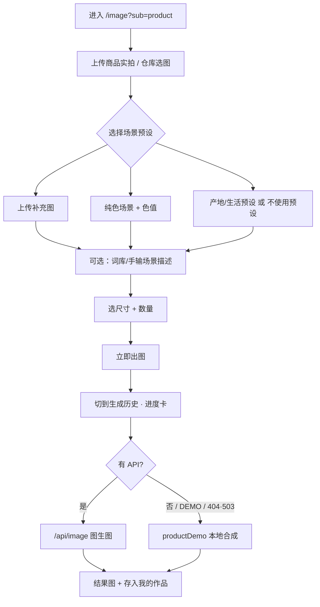

# 商拍设计 PRD 文档

> 模块路径：品牌设计 → 商拍　|　页面 `/image?sub=product`  
> 版本：v3.1（对齐当前实现：主路径为「商品换背景」；「场景融合」独立 Tab 已并入场景预设中的「上传补充图」）

---

## 功能概述

**商拍（商品出图台）**：上传商品实拍 / 包装图，一键换成电商主图可用的背景——支持产地/生活场景预设、纯色场景、用户自传补充场景图；可选词库拼装场景描述。出图固定即梦 Seedream，前端不切换模型。右侧「生成历史 / 参考灵感」双 Tab，样张可一键套用。

**模块说明**

- 左侧为单栏表单（无顶层 Tab）：商品实拍 → 场景预设 → 自定义场景描述（选填）→ 尺寸 / 数量 →「立即出图」。
- 有商品图时走图生图，强制「保主体」约束；无 API / `DEMO` 时本地合成演示图。
- 右侧「生成历史」展示进度与结果（收藏 / 下载 / 另存；商拍关闭「编辑 / 深度编辑」）；「参考灵感」展示样张，可套用回填。
- 出图自动存入「仓库 · 我的作品」，生成历史持久化到本地 `mofun.productRuns`。

**产品定位**

面向农旅县域机构与特产店铺，快速产出可过审的电商主图 / 场景图，对标美图设计室、图叮等「商品换背景」能力，强调产地真实氛围与主体保真。

---

## 1. 商品换背景（当前主路径）

### 1.1 业务字段

| 字段 | 必填 | 类型 | 说明 |
|---|---|---|---|
| 商品实拍 | 是 | 上传 / 仓库 | JPG / PNG / WEBP，≤10MB；支持仓库从「我的素材 / 作品」选用；带预览与清除 |
| 场景预设 | 否 | 缩略图网格 | 上传补充图 / 纯色场景 / 10 个产地·生活预设；再点已选项可取消（回到「不使用预设」） |
| 纯色色值 | 条件 | 色板 | 仅选「纯色场景」时出现，默认 `#FFFFFF` |
| 自定义场景描述 | 否 | 多行文本 + 词库 | 选填；可点词库 tag 拼入，或手输；出图时 tag 展开为完整 prompt 片段 |
| 出图尺寸 | 是 | 下拉 | 见 1.3；选「自定义」展开宽 × 高（px，最小 64） |
| 生成数量 | 是 | 分段 | 1 / 2 / 3 / 4，默认 1 |
| 生图模型 | — | 固定 | `Seedream-5.0-lite`，前端不展示切换 |

**商品上传文案**

- 主文案：上传商品图 / 包装图
- 副文案：手机实拍即可 · 支持仓库选用

### 1.2 场景预设

前 6 项默认可见，点「更多预设选项」展开全部。

| 顺序 | 名称 | 说明 |
|---|---|---|
| 1 | 上传补充图 | 用户上传 / 仓库选一张场景参考图，与商品图合成双图参考后出图 |
| 2 | 纯色场景 | 商品置于所选纯色背景（可调色板） |
| 3 | 高山茶园 | 层叠茶垄与薄雾，自然晨光 |
| 4 | 竹林青石 | 竹林边青石台面，斑驳光影 |
| 5 | 稻田秋收 | 金黄稻田收获季，暖色自然光 |
| 6 | 果园枝头 | 果园枝头与木筐，户外柔光 |
| 7 | 山泉溪边 | 清澈山泉溪石，清凉自然氛围 |
| 8 | 农家餐桌 | 粗陶餐桌、碗碟餐布，烟火气 |
| 9 | 民宿窗台 | 原木窗台，窗外山景虚化 |
| 10 | 厨房料理 | 明亮厨房台面，料理使用氛围 |
| 11 | 原木静物 | 原木桌面与竹编、粗陶点缀 |
| 12 | 节日礼赠 | 节日礼赠氛围，丝带点缀克制 |

> 预设空景静态图位于 `public/productcase/scene-*.png`；离线环境亦可展示与 DEMO 合成。  
> 内部常量：`PRODUCT_AI_SCENE_UPLOAD` / `COLOR` / `NONE`（取消选中）/ `WHITE`（纯白底，数据层保留，当前网格未单独露出）。

**上传补充图交互**

1. 点选「上传补充图」→ 触发文件选择（或点仓库选用）。
2. 有图后网格内显示缩略图 + 清除。
3. 立即出图前若未上传补充图 → 提示「请先上传场景补充图」。

### 1.3 出图尺寸

| 名称 | 像素 |
|---|---|
| 自定义 | 用户输入宽 × 高（≥64px） |
| 电商主图1:1 | 800 × 800 |
| 方版1:1 | 1080 × 1080 |
| 竖版3:4 | 1080 × 1440 |
| 竖版9:16 | 1080 × 1920 |

> 送模型时按 Seedream 最小像素要求（约 ≥369 万像素）等比放大，提示词仍按所选比例描述。淘宝/京东 800×800 已合并为「电商主图1:1」。

### 1.4 自定义场景描述 · 词库

描述为**选填**，不因为空拦截生成。词库分三个 Tab，点 tag 写入描述（逗号分隔），再点可取消；出图时将 tag 名替换为对应 prompt。

| Tab | Tags |
|---|---|
| 主体 | 悬浮展示、平铺俯拍、模特佩戴、手持特写、3D渲染、微距特写 |
| 装饰 | 热带植物、鲜花点缀、水珠、烟雾缭绕、丝绸飘带、几何石膏、光影斑驳、竹叶、麦穗、露珠 |
| 光线 | 自然光、柔光箱、硬光、侧逆光、轮廓光、霓虹光、晨光、夕阳 |

### 1.5 交互流程

1. 上传商品实拍（必填）。
2. 选场景预设（可选）；选「上传补充图」须再上传场景图。
3. （可选）填自定义场景描述或点词库。
4. 选尺寸与数量。
5. 点「立即出图」→ 右侧切「生成历史」→ 进度推进 → 出图完成替换为结果图。
6. 成功后 Toast，并写入「我的作品」。

### 1.6 出图提示词规则

**固定追加（无前端开关）**

- 去 AI 感：`写实商业摄影，真实材质与微瑕保留，自然光影，非 CGI，非塑料感，非过度磨皮，像相机实拍`
- 有商品实拍时保主体：`【必须严格保留参考图中的商品主体】外形、配色、材质、包装与标签细节与参考图一致……仅按任务要求调整背景、构图、光影与场景`

**按场景分支（摘要）**

| 场景 | 行为 |
|---|---|
| 纯色场景 | 白/色底棚拍主图构图 + 用户描述 |
| 产地/生活预设 | 商品主体溶入该场景 prompt，光影与场景一致 |
| 上传补充图 | 商品图 + 补充图合成双图参考；提示「将商品放入补充场景图所示环境」 |
| 不使用预设 | 主要跟用户描述 / 默认农旅商品表述出图 |

**扩写**：有商品实拍、套用灵感（`fromCase`）、DEMO 时跳过 LLM 二次扩写，避免改写主体。

**历史行标签示例**：`商品换背景·高山茶园` / `商品换背景·纯色` / `商品换背景·补充图`。

---

## 2. 右侧画廊：生成历史 / 参考灵感

### 2.1 生成历史

| 元素 | 说明 |
|---|---|
| Tab | 生成历史 / 参考灵感；点「立即出图」自动切到生成历史 |
| 只看收藏 | 开关，仅显示已收藏结果 |
| 行头 | 任务标签 + 尺寸 + 复制描述 / 删除 + 时间 |
| 进度卡 | 出图中显示进度百分比 |
| 结果图 | 多张并排；收藏 / 下载 / 另存为我的素材 |
| 编辑入口 | **关闭**（`resultEdit={false}`），不提供活动模块的「编辑 / 深度编辑」 |

- 结果点击可放大预览。
- 持久化：`localStorage` 键 `mofun.productRuns`（剥离 data:/blob: 大图防占满配额）；首次进入可注入预置种子历史。

### 2.2 参考灵感

| 元素 | 说明 |
|---|---|
| 卡片样式 | IP 式上图下文（`caseStyle="ip"`） |
| 样张 | 至少 3 条：白底主图 / 产地场景 / 生活场景（`public/productcase/`） |
| 套用模版 | 回填场景描述 + 场景预设/纯色映射 + 尺寸（原图 w×h 为自定义），标记 `fromCase` |
| 点击卡片 | 仅回填场景模式与尺寸，不改描述 |

| sub | 样张名 | 尺寸 |
|---|---|---|
| 白底主图 | 茶罐白底主图 | 1080×1080 |
| 产地场景 | 高山茶园场景图 | 1080×1080 |
| 生活场景 | 民宿窗台氛围图 | 1080×1080 |

**套用映射（`productGalleryBgPatch`）**

- 白底主图 / 细节特写 → 纯色场景
- 名称含预设名 → 对应产地/生活预设
- 含「民宿」→ 民宿窗台；含「竹林」→ 竹林青石
- 默认 → 高山茶园

---

## 3. 错误与边界（对齐实现）

| 场景 | 用户提示 |
|---|---|
| 未上传商品实拍 | 请先上传商品图！ |
| 补充图未上传 | 请先上传场景补充图 |
| 自定义宽高无效 | 请填写有效的自定义宽高（最小 64px）！ |
| 上传格式/大小不符 | 仅支持 JPG、PNG、WEBP / 图片不能超过 10 MB |
| 安全审核 | 描述内容未通过安全审核，请调整后重试 |
| 配额 | 今日生成次数已达上限（弹层：明日再来 / 联系客服） |
| 超时 | 商拍图生成超时，请稍后重试 |
| 全失败 | 未能生成合适的结果，请尝试修改描述或商品图 |
| 部分失败 | 已生成 x/n 张（部分超时），已存入「我的作品」 |
| 网络 | 网络错误，商拍图生成失败。 |
| 实拍读取失败 | 实拍图读取失败，请重新上传后重试 |
| 本地存储满 | 本地存储空间不足，历史记录可能无法保存 |

> 画面描述为**选填**，不再因描述为空拦截生成。精简表见 `docs/product-error-scenarios.md`。

---

## 4. DEMO / 离线兜底

| 条件 | 行为 |
|---|---|
| `NEXT_PUBLIC_DEMO=1` / `DEMO` | 不调 `/api/image`，走 `demoProductGenerate` |
| API 返回 404 / 503 | 回落本地 DEMO 合成 |
| 网络失败且重试耗尽 | 回落 DEMO |

本地合成能力：商品抠图后铺色 / 与场景空景合成 / 双图并排示意等，保证静态站与演示环境可走通「上传 → 出图 → 下载」。

---

## 5. 数据层与关键文件

| 文件 | 职责 |
|---|---|
| `src/components/image/ImageProductPanel.tsx` | 左侧表单 + `ProductStudioState` |
| `src/components/image/ImageEditor.tsx` | `runProductStudio`、双图合成、仓库弹窗 |
| `src/components/image/ActiveGallery.tsx` | 右侧历史 / 灵感通用画廊 |
| `src/data/productStudio.ts` | 预设、词库、prompt、尺寸、模式常量 |
| `src/data/image.ts` | `productGalleryItems` |
| `src/lib/productDemo.ts` | 离线 DEMO 出图 |
| `src/lib/productRunsStorage.ts` | 生成历史持久化 |
| `src/lib/productSceneThumbs.ts` | 场景缩略图缓存 / 补生成 |
| `src/lib/productCutout.ts` | 本地 WASM 抠图（换底本地路径） |
| `public/productcase/` | 场景空景 + 灵感样张 |

---

## 6. 已收拢 / 未露出能力（本期说明）

以下在数据层或历史版本中存在，**当前左栏 UI 不露出**，不作为本期验收范围；二期可再开放：

| 能力 | 说明 |
|---|---|
| 场景融合独立 Tab | 已删除；能力并入「上传补充图」 |
| 多角度（aimulti） | 右/左/背面/自定义视角批量 |
| 抠图白底 / 透明底 / 抠图色底 | 本地 WASM 抠图路径 |
| 场景底（溶图换景） | 须上传场景的本地溶图模式 |
| 多任务卡 | 白底主图、细节特写、礼盒套图等已收拢为「换底抠图」单任务 |
| 商品名输入框 | 状态字段保留，UI 未露出 |
| 纯白底独立 tile | 常量保留，网格用「纯色场景」覆盖白底诉求 |

**命名演变**

1. 多任务卡 → 收拢为换底抠图  
2. 「商品场景 / 图片结合」→ 重命名为「商品换背景 / 场景融合」  
3. 去掉「场景融合」Tab → **仅「商品换背景」**（含上传补充图）

---

## 7. 验收标准

- [ ] `/image?sub=product` 可进入商拍工作台，左表单 + 右历史/灵感。
- [ ] 未上传商品图点出图 → 提示「请先上传商品图！」。
- [ ] 选「上传补充图」未传图 → 提示「请先上传场景补充图」。
- [ ] 选产地预设（如高山茶园）+ 商品图 → 可出至少 1 张结果并出现在生成历史。
- [ ] `NEXT_PUBLIC_DEMO=1` 无 API 时可走通：上传 → 出图 → 下载。
- [ ] 参考灵感至少 3 条可套用，回填描述与场景。
- [ ] 仓库可选商品图与补充图。
- [ ] 出图成功写入「我的作品」。

---

## 8. 配图位

> 以下为占位，截图替换：

- 图 1：商拍左栏（商品实拍 + 场景预设网格 + 词库）
- 图 2：选「上传补充图」后的缩略图与仓库入口
- 图 3：生成历史进度卡与结果图
- 图 4：参考灵感样张（套用模版 hover）
- 图 5：纯色场景 + 色板

---

## 附：依赖接口

| 接口 | 用途 | 说明 |
|---|---|---|
| `/api/image` | 商拍图生图 | `Seedream-5.0-lite`；可选 `image`（商品 / 双图合成 data URL）；尺寸按最小像素放大 |
| `/api/generate` | 提示词扩写（条件跳过） | scene ≈ `t2i-product`；有实拍 / fromCase / DEMO 时跳过 |
| `/api/proxy-image` `/api/download` | 结果图下载 | 跨域代理拉取 |

> 部署注意：静态导出（nginx）不含 `/api` 时依赖 DEMO 本地合成；正式出图需 Node 全栈或已配置图片 API 的环境。
