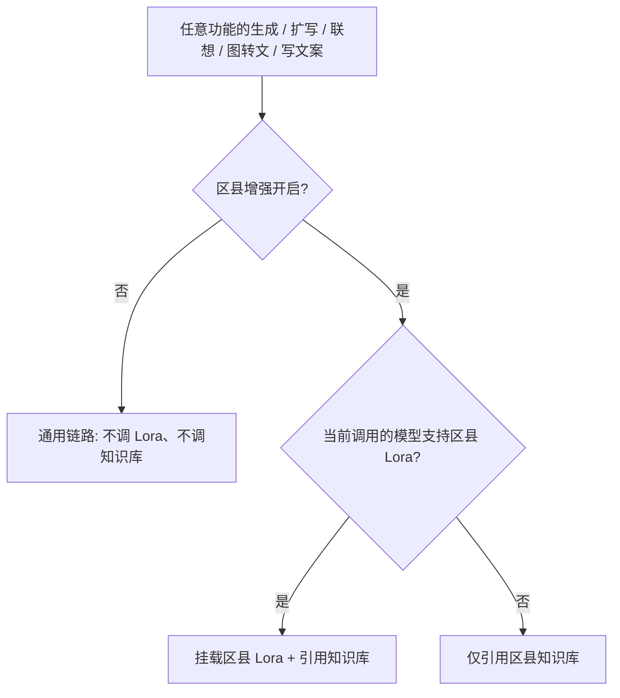

# 全站 · 区县增强：模型 / Lora / 知识库调用逻辑

> 范围：平台内所有创作功能（品牌设计、视频、内容、调研、数字人、小墨助手）。  
> 目标：每个功能都具备「区县增强」能力；开启后，**按当前所调模型**决定能否挂载 **区县 Lora**、能否引用 **区县知识库**。关闭则一律不调。

文案统一用「区县」，不用「地域」。

---

## 1. 总开关（全站同一套）

| 状态 | 含义 |
|------|------|
| **开启区县增强** | 允许调用区县知识库；若当前步骤所用模型 **支持区县 Lora**，额外挂载选中 Lora |
| **关闭区县增强** | **一律不调用**：不挂 Lora、不检索/注入知识库；该功能下所有子步骤（联想、图转文、扩写、出图、成片、写文案）都走通用链路 |

账号区县由登录账号归属解析（如安吉 / 德清），决定知识库包与默认 Lora 包。

派生字段（各功能共用概念）：

```ts
type RegionInvoke = {
  regionEnhance: boolean;
  model: string;            // 当前步骤实际调用的模型名 / modelId
  loraIds: string[];
  loraStrengths: Record<string, number>;
  // useKB   = regionEnhance
  // useLora = regionEnhance && modelSupportsCountyLora(model)
};
```

---

## 2. 通用能力矩阵

以「区县增强 × 当前调用模型是否支持区县 Lora」判定：

| 区县增强 | 当前调用的模型 | 区县 Lora | 区县知识库 |
|----------|----------------|-----------|------------|
| 关 | 任意 | ✗ | ✗ |
| 开 | **支持区县 Lora 的模型**（下称「区县模型族」） | ✓ | ✓ |
| 开 | **不支持区县 Lora 的模型**（普通图模 / 视频模 / LLM 等） | ✗ | ✓ |



### 2.1 哪些模型「支持区县 Lora」

| 模型族 | 典型名称 | 支持 Lora | 支持知识库（增强开时） |
|--------|----------|-----------|------------------------|
| 文生图 · Qwen 本地 | `Qwen-Image-本地-文生图`（ComfyUI；旧名「区县模型」） | ✓ | ✓ |
| 图生图 · Qwen 本地 | `Qwen-Image-本地-图生图`（ComfyUI；活动「基础编辑」；旧名「区县编辑模型」） | ✓ | ✓ |
| 其它文生图 | Z-Image / `doubao-seedream-4-0-250828` / `4-5` / `5-0` | ✗ | ✓ |
| 其它图生图编辑模型 | Seedream 4.0 高清重绘 / 4.5 局部重绘 | ✗ | ✓ |
| 商拍 / 店招固定出图 | 非 Qwen 本地通道时 | ✗ | ✓ |
| 视频模型 | Seedance 1.0 Pro / 1.5 Pro / 2.0 / Fast / Mini | ✗ | ✓ |
| 文本 LLM | `deepseek-v4-flash` / `qwen3.7-plus` 等 | ✗（文本无 Lora） | ✓ |
| 视觉理解 | `doubao-seed-1-6-vision` 等 | ✗ | ✓（转写后二次注入） |
| TTS / 声音复刻 / 对口型 | 火山 BigTTS / ICL / OmniHuman | ✗ | ✗（音频链路不注入） |

后续若上线「区县视频模型」或商拍可选 Qwen 本地，只需把该模型加入「支持 Lora」表，矩阵自动生效。

### 2.2 知识库 vs Lora 职责

| 资产 | 作用阶段 | 作用方式 |
|------|----------|----------|
| 区县知识库 | 文本侧：联想、图转文、扩写、脚本、文案、调研、口播稿 | RAG / 摘要注入 prompt |
| 区县 Lora | 图像侧：仅出图 / 改图 | 随区县模型族通道加载 ids + 强度 |

知识库管「说什么」，Lora 管「画成什么样」。纯文本 / 视频 / TTS 步骤永远只可能调知识库，不调 Lora。

---

## 3. 分功能规范

每个功能均需：

1. 左栏（或设置区）有 **区县增强开关**（默认：有区县模型可选时开启；纯文本功能可默认开启）。
2. 开启后展示当前账号区县名；若当前模型支持 Lora，展示 Lora 选择与强度。
3. 关闭后该功能内所有子调用都不带 `useKB` / `loraIds`。

---

### 3.1 活动 · 文生图

| 子步骤 | 接口 / scene | 增强关 | 增强开 + 区县模型 | 增强开 + 非区县图模 |
|--------|--------------|--------|-------------------|---------------------|
| 联想 | `/api/generate` `t2i-associate` | 通用扩写 | 知识库 | 知识库 |
| 图转文 | `/api/vision` → 可选再 LLM 补区县 | 纯视觉转写 | 知识库 | 知识库 |
| 出图前扩写 | `/api/generate` `t2i-event` | 不注入 | 知识库 | 知识库 |
| 立即生成 | `/api/image` | 不挂 Lora | **Lora + 知识库已写入的 prompt** | 不挂 Lora |

UI：增强条挂在生图模型下方（或成图类型上方，与现实现一致）；仅选「区县模型」时展示 Lora 区，非区县模型仍可保留总开关（只调知识库）。

---

### 3.2 活动 · 图生图（重点）

图生图当前编辑模型为：基础编辑 / 高清重绘 / 局部重绘。规范要求：

- 编辑模型列表 **增加「区县编辑模型」**（首位），与文生图「区县模型」同属区县模型族，**可挂 Lora**。
- 左栏增加与文生图同款 **区县增强** 条（不依赖文生图 Tab）。
- 选中区县编辑模型 → 默认开启增强，展示 Lora。
- 选中其它编辑模型 → 仍可开增强，**只调知识库**，修改需求扩写时注入区县摘要（换风格 / 换背景 / 增加元素等可带产地语境）。
- 关闭增强 → 改图纯按用户「修改需求」+ 参考图，不调 Lora、不调知识库。

| 子步骤 | 增强关 | 增强开 + 区县编辑模型 | 增强开 + 其它编辑模型 |
|--------|--------|----------------------|----------------------|
| 修改需求扩写（若有） | 不注入 | 知识库 | 知识库 |
| 立即改图 `/api/image`（带参考图） | 不挂 Lora | **挂 Lora** | 不挂 Lora |

注意：图生图必须保参考图主体；知识库只补区县语境，不得改掉参考图中不存在的主体结构。

---

### 3.3 商拍（商品换背景 / 多角度等）

| 子步骤 | 当前模型 | 增强关 | 增强开 |
|--------|----------|--------|--------|
| 场景描述扩写 `t2i-product` | LLM | 不注入 | **知识库**（产地、物产气质） |
| 出图 | 固定 `Seedream-5.0-lite`（不支持 Lora） | 不挂 Lora | **仅知识库**（已写入 prompt）；不挂 Lora |
| 本地抠图白底/透明/色底 | 无云端图模 | — | 不调 Lora / 不调知识库（本地合成） |

若日后商拍开放模型切换并选出「区县模型」，则该路径按通用矩阵同时挂 Lora。

UI：场景描述上方或尺寸上方增加区县增强开关；因默认无区县图模，开关打开后文案为「将引用区县知识库」，不展示 Lora 选择（除非切换到支持 Lora 的模型）。

---

### 3.4 Logo 设计

| 子步骤 | 模型 | 增强关 | 增强开 |
|--------|------|--------|--------|
| 创意描述补全（若有联想） | LLM（如 deepseek-v4-flash） | 不注入 | 知识库（区县符号、物产意象） |
| Logo 生成 | `Qwen-Image-本地-文生图`（ComfyUI） | 不挂 Lora | **Lora + 知识库** |
| Logo 下载相关图生 / 扣图 / 转矢量 | Qwen 本地图生图 / 美图 / 怪兽科技 | — | 按下游能力；增强态仍可带已注入的区县语境 |

UI：风格网格上方区县增强条；固定走 Qwen 本地文生图，开启增强时提示「将应用区县 Lora 与知识库」。

---

### 3.5 IP 设计（含扩展设计图生图）

| 子步骤 | 模型 | 增强关 | 增强开 |
|--------|------|--------|--------|
| 帮我提案 `ip-propose` | deepseek-v4-flash | 不注入 | 知识库 |
| 创意描述优化 `ip` | deepseek-v4-flash | 不注入 | 知识库 |
| IP 故事 `ip-story` / 识图 `vision` | deepseek-v4-flash / Vision | 不注入 | 知识库（故事贴区县；识图仍忠于原图） |
| 首轮出图（创新设计） | `Qwen-Image-本地-文生图` | 不挂 Lora | **Lora + 知识库** |
| 扩展设计图生图 | `Qwen-Image-本地-图生图` | 不挂 Lora | **Lora + 知识库**（保人物一致） |

扩展设计是图生图：有参考 IP 图时保人物一致；知识库只强化区县背景/服饰符号，不改脸。

---

### 3.6 AI 字体

| 子步骤 | 模型 | 增强关 | 增强开 |
|--------|------|--------|--------|
| Font 生成 | `Qwen-Image-本地-文生图` | 不挂 Lora | **Lora + 知识库**（字体气质/区县纹样） |
| Font 转高清 | `Qwen-Image-本地-图生图` | — | 按增强态 |
| 透明 / 矢量 | 美图扣图 / Comfy 基础转矢量 / 怪兽科技增强转矢量 | — | 下游能力 |

纯文字效果类预设与知识库弱相关；关闭增强则完全不注入。

---

### 3.7 店招设计

| 子步骤 | 模型 | 增强关 | 增强开 |
|--------|------|--------|--------|
| prompt 组装 | 本地规则 + 可选 LLM | 不注入 | 知识库（区县产业、门头常见物产意象） |
| 出图 | 固定 `Seedream-5.0-lite` | 不挂 Lora | 仅知识库；不挂 Lora |

与商拍相同：固定非区县图模时只有知识库路径。

---

### 3.8 一句话成片（文生视频 / 图生视频）

| 子步骤 | 模型 | 增强关 | 增强开 |
|--------|------|--------|--------|
| 提示词优化 `/api/video-prompt` | LLM | 不注入 | 知识库 |
| 风格推断 `/api/video-style-infer` | LLM | 不注入 | 可不注入（风格枚举固定） |
| 立即生成组装 `/api/video-generate` | LLM | 不注入 | 知识库写入 `finalPrompt` |
| 出视频 `/api/video` | Seedance 族 | 不挂 Lora | **仅知识库**（视频模型暂不支持区县 Lora） |

UI：模型选择下方增加区县增强开关。开启后说明「将结合账号区县知识库优化画面描述」。

---

### 3.9 制作大片

现有「知识库：使用 / 不使用」与区县增强 **合并为同一开关**（避免两个入口打架）。

| 子步骤 | 模型 | 增强关 | 增强开 |
|--------|------|--------|--------|
| 剧本 / 镜头摘要 / 完整镜头 / 专业脚本 | LLM（`studio-*`） | 不注入（`useKB=false`） | 知识库（区县特产/景点/民俗） |
| 场景角色道具 / 参考图描述扩写 | LLM | 不注入 | 知识库 |
| 参考图出图 `/api/image` | 可选图模或默认 `IMAGE_MODEL` | 不挂 Lora | 区县图模 → Lora；其它 → 仅 KB |
| 逐镜视频 `/api/video` | Seedance 族 | 不挂 Lora | 仅知识库（脚本侧已注入） |

---

### 3.10 数字人模特

| 子步骤 | 模型 | 增强关 | 增强开 |
|--------|------|--------|--------|
| 口播文案 `avatar-script` | LLM | 不注入 | 知识库 |
| 角色描述优化 `/api/avatar-desc` | LLM | 不注入 | 知识库（区县人物气质，勿编造真人） |
| AI 形象生图 / 背景生图 / 图像合成 | `/api/image` 默认图模 | 不挂 Lora | 区县图模 → Lora；否则仅 KB |
| 动态背景 i2v | `seedance-2.0-mini` | 不挂 Lora | 仅 KB（描述里已注入） |
| TTS / 声音复刻 / 对口型 | 火山语音 / OmniHuman | — | **不调** Lora 与知识库 |

---

### 3.11 内容创作（社媒 / 公众号 / 品牌推广）

文本无 Lora。增强只影响知识库。

| 子步骤 | scene | 增强关 | 增强开 |
|--------|-------|--------|--------|
| 社媒推文 | `social` | 通用文案 | 知识库（物产卖点、节庆、产地话术） |
| 公众号帮写 | `official` | 通用长文 | 知识库 |
| 品牌推广策划 | `brand` | 通用策划 | 知识库 |
| 配图 / 推广海报 | `/api/image` 默认图模 | 不挂 Lora | 区县图模 → Lora；否则仅 KB |

UI：各场景表单顶部增加区县增强开关，默认开。

---

### 3.12 市场调研（品牌 / 产业 / 爆款）

| 子步骤 | scene | 增强关 | 增强开 |
|--------|-------|--------|--------|
| 品牌市场调研 | `research-brand` | 通用报告 | 知识库（区县品牌、竞品、渠道） |
| 产业调研 | `research-industry` | 通用报告 | 知识库 |
| 爆款分析 | `research-hotsale` | 通用报告 | 知识库 |

无出图则无 Lora。关闭增强后不得出现账号区县专有条目（除非用户主题里自己写了地名）。

---

### 3.13 小墨助手 / Agent

| 子步骤 | 增强关 | 增强开 |
|--------|--------|--------|
| 对话 `agent-chat` | 不主动检索区县库 | 结合区县知识库回答（仍禁止假装已出图） |
| 提案 / 生成工具 | 随所调 skill 的模型矩阵 | 与对应功能（活动/IP/社媒等）同一套 `useKB` / `useLora` |

助手不单独再做一个冲突开关：沿用当前工作台所选功能的增强状态；无工作台上下文时用账号级默认（建议默认开）。

---

## 4. 全站总表（功能 × 开启增强后）

| 一级 | 功能 | 文本侧（LLM / Vision） | 出图 / 改图 | 出视频 / 语音 |
|------|------|------------------------|-------------|---------------|
| 品牌设计 | 活动文生图 | 知识库 | 区县模型→Lora+KB；其它→仅KB | — |
| 品牌设计 | **活动图生图** | 知识库（改需求扩写） | **区县编辑模型→Lora+KB**；其它编辑模型→仅KB | — |
| 品牌设计 | 商拍 | 知识库 | 固定 Seedream→仅KB | — |
| 品牌设计 | Logo | 知识库 | 视所选图模 | — |
| 品牌设计 | IP / 扩展设计 | 知识库 | 视所选图模（扩展为图生图，规则同左） | — |
| 品牌设计 | AI 字体 | 知识库 | 视所选图模 | — |
| 品牌设计 | 店招 | 知识库 | 固定 Seedream→仅KB | — |
| 视频 | 一句话成片 | 知识库 | 参考图生图时视所选图模 | Seedance→仅KB，无 Lora |
| 视频 | 制作大片 | 知识库（剧本/分镜/资产） | 参考图视所选图模 | Seedance→仅KB |
| 视频 | 数字人 | 知识库（口播/角色描述） | 形象/背景视所选图模 | TTS/对口型不调 |
| 内容 | 社媒 / 公众号 / 品牌 | 知识库 | 配图视所选图模 | — |
| 调研 | 品牌 / 产业 / 爆款 | 知识库 | — | — |
| 助手 | 小墨 | 知识库 | 跟所调功能走 | 跟所调功能走 |

**关闭区县增强：上表全部变为「不调」。**

---

## 5. UI 约定

| 位置 | 行为 |
|------|------|
| 增强条标题 | `区县增强` + 账号区县名（如安吉） |
| 开关关 | 文案：`本次生成将不使用区县 Lora 与知识库` |
| 当前模型支持 Lora | 展示 Lora 多选 + 强度；详情说明增强前后差异 |
| 当前模型不支持 Lora | 不展示 Lora 选择；提示 `当前模型已引用区县知识库` |
| 生成中 | 同时用 Lora+KB → `正在应用区县 Lora 与知识库…`；仅 KB → `正在引用区县知识库…` |
| 点击生成类按钮（增强开） | Toast：`正在使用区县增强效果（区县 Lora 与知识库）` 或 `…（区县知识库）` |
| 结果角标 | 与生成中文案一致，可点开只读说明 |

图生图与文生图共用 `RegionEnhanceStrip`，状态可按 Tab 共用一份 `regionEnhance / loraIds`，避免来回切换丢失；**是否挂 Lora 仍以该次实际调用的模型为准**。

---

## 6. 调用链路（图生图示例）

### 6.1 增强开 + 区县编辑模型

```
修改需求（可选扩写）
  → LLM + 区县知识库
  → /api/image
       model = 区县编辑模型
       image = 参考图
       loraIds / loraStrengths
```

### 6.2 增强开 + 高清重绘等普通编辑模型

```
修改需求扩写 + 区县知识库
  → /api/image
       model = 高清重绘模型
       image = 参考图
       不传 Lora
```

### 6.3 增强关

```
修改需求原文 + 参考图
  → /api/image（所选编辑模型）
  → 无知识库、无 Lora
```

文生图 / Logo / IP / 视频脚本等同理，只是「当前模型」换成该步骤真实调用的模型。

---

## 7. 验收清单

- [ ] 每个一级功能左栏（或设置区）都能看到区县增强开关
- [ ] 关闭后：联想、图转文、扩写、出图、成片、文案、调研均无区县库痕迹、无 Lora
- [ ] 活动图生图：区县编辑模型出图带 Lora；其它编辑模型仅知识库
- [ ] 活动文生图：区县模型带 Lora；其它图模仅知识库
- [ ] 商拍 / 店招 / Seedance：开启增强只有知识库，无 Lora
- [ ] 内容 / 调研：开启增强只影响 LLM，无 Lora
- [ ] 数字人 TTS / 对口型：增强开关不影响语音链路
- [ ] 制作大片原「知识库」选项与区县增强合并，无双开关冲突
- [ ] 切换模型或开关后，下一次请求立即按新矩阵生效

---

## 8. 与现状差距（实现备忘）

| 项 | 现状 | 规范要求 |
|----|------|----------|
| 活动文生图增强条 | 仅区县模型时展示；切走其它模型会关掉增强 | 非区县图模也应能开增强（只调知识库）；或保留「切走即关」但须在文档/产品上写清 |
| 活动图生图 | 无增强条；编辑模型无区县编辑模型；出图未传 model/Lora | 补条 + 补区县编辑模型 + 按矩阵传参 |
| 商拍 / 店招 / Logo / IP / 字体 | 无增强开关 | 补开关；文本注入 KB；出图按模型能力 |
| 一句话 / 数字人 | 无统一增强开关 | 补开关；脚本/描述走 KB |
| 制作大片 | 已有知识库使用/不使用 | 与区县增强合并 |
| 内容 / 调研 | 无开关 | 补开关 + `useKB` 传入 `/api/generate` |
| 真实 RAG / Lora 推理 | 多为展示或 `county: ""` | 落地时真正传入检索与 Lora ids |

实现以本文矩阵为准；先文档对齐，再按模块接线。

---

## 9. Lora 多维匹配（风格不按区县）

风格 Lora 全站共用、不按区县拆包；在地 Lora 随增强开关。完整**调用标准**（场景 + 匹配规则 + 上送契约）见：

→ [`docs/模型调用Lora调用标准.md`](./模型调用Lora调用标准.md)  
→ 实现：`src/data/loraCatalog.ts` · `src/lib/loraMatch.ts`

